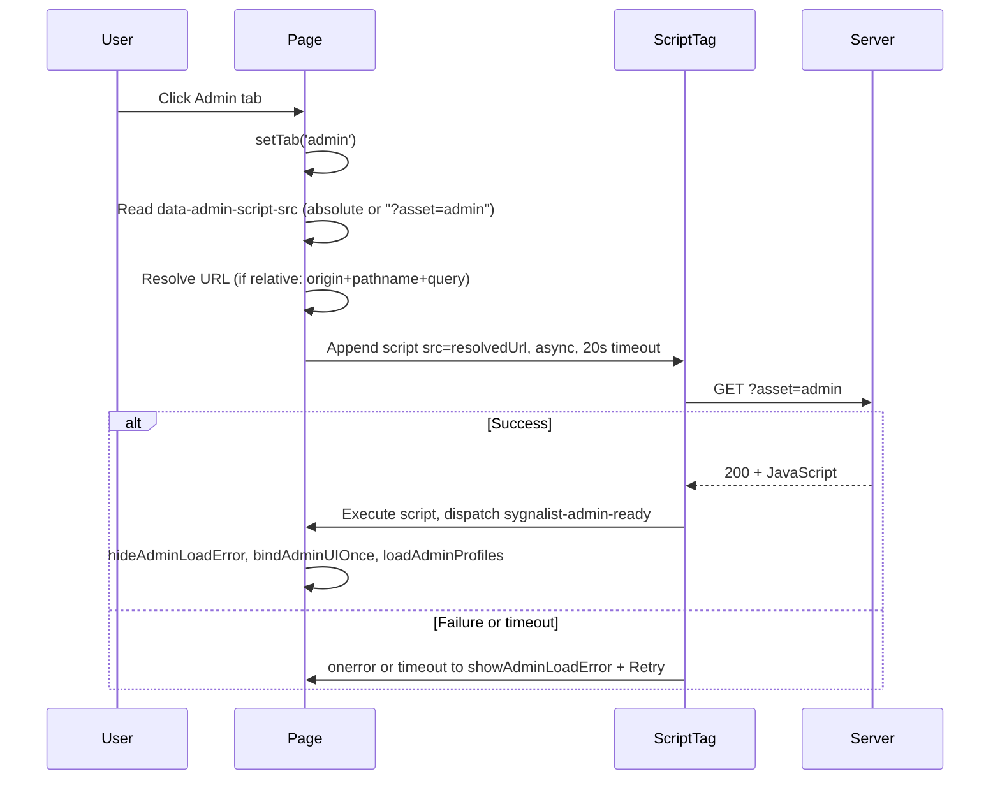

# Admin Portal Load Fix Plan

## Problem summary

- **"Admin script failed to load"**: The ``, `?>`, `</`).
   - Use these for `BOOTSTRAP_JSON`, `ADMIN_BOOT_SCRIPT_TAG`, `ADMIN_SCRIPT_SRC`, and any other dynamic values written into [client_portal.html](client_portal.html) or included partials.

3. **Never return non–well-formed HTML from doGet.**  
   HtmlService expects valid HTML when you use `createHtmlOutput(...)`. The current catch block in [webapp.js](webapp.js) (lines 129–132) returns:
   `createHtmlOutput("Portal load failed:\n" + String(err...))`  
   That is **not** valid HTML (no DOCTYPE, no `<html>`, `<head>`, `<body>`). Such output can trigger "Malformed HTML content" when GAS serves it.
   - **Change:** In the `doGet` catch block, return a **minimal valid HTML document** instead of raw text, e.g. `<!DOCTYPE html><html><head><meta charset="UTF-8"/><title>Error</title></head><body>
Portal load failed. Try again later.
</body></html>`. Optionally include a sanitized (HTML-escaped) error message in a `<pre>` or `
` so it does not contain `<`, `>`, or `&` that could break the document.

4. **Asset endpoint must return only JavaScript.**  
   For `?asset=admin`, the response must always be `ContentService.createTextOutput(...).setMimeType(ContentService.MimeType.JAVASCRIPT)`. If you add a server-side fallback (e.g. when `createHtmlOutputFromFile("admin_tab_script").getContent()` throws), the fallback must still be a string of **JavaScript** (e.g. a one-liner that sets a global and dispatches `sygnalist-admin-ready`), not HTML. That way the browser never receives HTML for the script tag and will not fire `onerror` due to "not valid JS".

5. **No unescaped user or server data in HTML.**  
   When inserting error messages or dynamic text into HTML (including the minimal error page above), escape `&`, `<`, `>`, `"`, `'` so the result cannot break the document or introduce script/style.

---

## Current flow

---

## Implementation plan

### 1. Use same-origin relative URL for the admin script (primary fix)

**Goal:** Ensure the script is always requested from the **same** deployment that served the page.

**Change in [webapp.js](webapp.js):** When `showAdminUI` is true, set `adminScriptSrc` to the relative value `"?asset=admin"` only (remove the branch that uses `sanitizedBaseUrl + "?asset=admin"`). Keep `CONFIG.WEB_APP_URL` for redirects and links only.

### 2. Fix doGet error response (avoid Malformed HTML)

**Goal:** Ensure the catch block never returns malformed HTML.

**Change in [webapp.js](webapp.js):** In the `doGet` catch block, replace the current `createHtmlOutput("Portal load failed:\n" + ...)` with a minimal valid HTML document (DOCTYPE, html, head, body) and an HTML-escaped error message. Do not inject raw `err.message` without escaping.

### 3. Increase admin script load timeout (cold start)

**Change in [portal_scripts.html](portal_scripts.html):** Increase the timeout from 20s to 50s (use a constant e.g. `ADMIN_SCRIPT_LOAD_TIMEOUT_MS = 50000`).

### 4. Keep preload; ensure it uses the same URL

After step 1, `ADMIN_SCRIPT_SRC` will be `?asset=admin`; preload in [client_portal.html](client_portal.html) will resolve relative to the document URL. No change required unless you add a version query (step 5).

### 5. Optional: Cache-bust admin script by version

In [webapp.js](webapp.js), append version to admin script URL (e.g. `?asset=admin&v=2.2.6` from `CONFIG.Sygnalist_VERSION`). In [portal_scripts.html](portal_scripts.html), resolution already preserves the full query.

### 6. Optional: Server-side safety for `?asset=admin`

In [webapp.js](webapp.js), wrap the `asset === "admin"` block in try/catch. On catch, return a minimal JS string (with MimeType.JAVASCRIPT) that sets a global error flag and dispatches `sygnalist-admin-ready` so the client never receives HTML for the script tag.

### 7. Admin script always signals readiness; Retry UX

[admin_tab_script.html](admin_tab_script.html) already sets `_adminScriptLoaded` and dispatches `sygnalist-admin-ready` at the end of the IIFE. Retry button behavior stays as is.

---

## Files to touch

| File | Changes |
|------|--------|
| [webapp.js](webapp.js) | Use relative `"?asset=admin"` for `adminScriptSrc`; fix doGet catch to return valid HTML; optional version param and try/catch for `?asset=admin`. |
| [portal_scripts.html](portal_scripts.html) | Increase admin script load timeout to 50s (constant). |
| [client_portal.html](client_portal.html) | No change required; only if version param added, ensure preload href matches. |

---

## Verification

- Open the app as an admin profile from the deployment URL. Click Admin; admin script loads and Profiles (and other tabs) work.
- After inactivity (cold start), Admin either loads within 50s or shows "Admin took too long to load" with Retry; Retry succeeds when warm.
- Trigger a server error (e.g. temporarily break a dependency): portal shows the new minimal HTML error page, not a blank or malformed response; no "Malformed HTML content" exception.
- Confirm "Request timed out" pill only appears for Inbox/Tracker API, not for admin script load.
