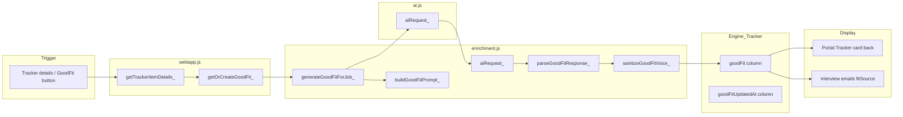

# GoodFit Audit Report (Audit Only — No Code Changes)

**Source of truth:** Sygnalist MASTER BLUEPRINT Section 2.3 (Language Filters) and Section 8.1 (Enrichment).  
**Audit date:** As of plan implementation. No code was changed.

---

## 1. GoodFit-related code paths (files and functions)

| Purpose | File | Function(s) |
|---------|------|-------------|
| **Prompt builder** | [enrichment.js](enrichment.js) | `buildGoodFitPrompt_(job, profile)` (lines 224–279) |
| **LLM call** | [ai.js](ai.js) | `aiRequest_(prompt, model)` (lines 100–140); no system/developer role — single user message |
| **GoodFit generator** | [enrichment.js](enrichment.js) | `generateGoodFitForJob_(job, profile)` (lines 323–336) |
| **Response parser** | [enrichment.js](enrichment.js) | `parseGoodFitResponse_(txt)` (lines 310–316) |
| **Post-processing** | [enrichment.js](enrichment.js) | `sanitizeGoodFitVoice_(text)` (lines 285–304) |
| **Orchestration (get/create)** | [webapp.js](webapp.js) | `getOrCreateGoodFit_(profileId, trackerKey, profile, force)` (492–520) |
| **Tracker write** | [tracker.js](tracker.js) | `updateTrackerRowGoodFit_(profileId, key, goodFitString)` (343–389) |
| **API entry** | [webapp.js](webapp.js) | `case "getOrCreateGoodFit"` (181–187); `getTrackerItemDetails_` (477–486) calls `getOrCreateGoodFit_` for details view |
| **UI rendering** | [portal_scripts.html](portal_scripts.html) | Tracker card back: `.good-fit-heading`, `.good-fit-back-content`, `.good-fit-statements`; split on `\n\s*\n`, up to 5 blocks rendered as `<p class="good-fit-statement">` (1300–1306, 1364–1365, 1373; spotlight 449–474, 542–571) |
| **Email usage** | [interview_emails.js](interview_emails.js) | `onMovedToInterview_`: uses `row.goodFit` else `row.whyFit` as `fitSource` for bullets/questions (201–203, 228–229) |

**Distinction in codebase:**
- **whyFit** = Inbox enrichment (batch during fetch); 3 paragraph blocks; stored in Engine_Inbox / Tracker at promote; schema in [engine_tables.js](engine_tables.js) (e.g. "whyFit" in Engine_Inbox and Engine_Tracker).
- **goodFit** = Tracker-only, on-demand; generated when user opens Tracker item details or clicks GoodFit; stored only in Engine_Tracker columns `goodFit` and `goodFitUpdatedAt` ([engine_tables.js](engine_tables.js) line 43; [tracker.js](tracker.js) 35–36, 116–119, 363–364).

---

## 2. Exact GoodFit prompt (as in repo)

The prompt is built by `buildGoodFitPrompt_(job, profile)` in [enrichment.js](enrichment.js) (lines 238–278). **Exact template** (variables injected as noted):

```text
You are writing a "Good Fit" note for a job-search tool. Return only the GoodFit content. No JSON, no markdown, no labels (no "Why you fit:" or similar).

FORMAT:
- Output exactly 3 paragraph blocks. No bullets, no numbering, no section labels, no headers, no em dashes, no emojis, no colon-led prefixes.
- Each block: 2-3 short sentences. Separate each block with a single blank line.

Structure (exactly 3 blocks):
- Block 1 (Concrete match): One specific fact from the candidate profile and one specific requirement from the job. Connect them plainly. Calm observation, not praise.
- Block 2 (Clear gap or unknown): A real gap, missing signal, or ambiguity. If no clear gap, state what is unclear in the posting and why it matters operationally. Do not fabricate missing skills.
- Block 3 (Realistic framing): How the candidate would speak to this in conversation; what evidence they would point to; how they would handle it early. Practical positioning only. Not advice, coaching, or encouragement.

TONE (non-negotiable):
- Sharp ops/account person thinking out loud next to the candidate. Not resume writer, motivational coach, LinkedIn post, chatbot, polished essay, or corporate HR. Short sentences (most under 18 words). Plain verbs: handled, ran, owned, fixed, tracked, escalated, coordinated. No motivational tone. No corporate tone. No resume summary language. Do not invent missing profile skills. If you cannot find a concrete profile fact, state "Profile signal missing on X" rather than fabricating alignment.

BANNED words and phrases (do not use): aligns, alignment, demonstrates, suggests, indicates, highlights, showcases, leverages, utilizes, transferable, dynamic, fast paced, passionate, self starter, rockstar, great fit, perfect fit, ideal candidate, consider, you should, try to, make sure, ability to, open question, interview answer, your experience, we're excited, don't worry, you're amazing, personal brand, 10x, dream role. No em dashes. No filler like "This is a great opportunity", "This position offers", "You would be well suited".

Example style (tone only; do not copy verbatim):
Block 1: "You've handled high volume customer interactions and kept the desk steady during busy shifts. The posting focuses on inbound questions and quick issue resolution. The pace looks similar."
Block 2: "The job mentions CRM tracking and structured reporting. Your profile does not clearly show system ownership. If reporting is central to the role, that could matter."
Block 3: "You would frame your strength in triage and follow through. Point to moments where you tracked issues from start to finish. Then explain how you would learn their system quickly and keep records clean from day one."

Candidate Skill Profile:
${skillProfileText ? skillProfileText : "(No skill profile text provided yet.)"}

Top Skills:
${topSkills.length ? topSkills.join(", ") : "(None listed.)"}

Signature Stories / Proof Points:
${signatureStories.length ? signatureStories.join("; ") : "(None listed.)"}

Job:
- Company: ${company}
- Title: ${title}
- Location: ${location || "N/A"}
- URL: ${url || "N/A"}

Job Description${desc ? " (truncated):" : " (not provided):"}
"""${desc || "N/A"}"""

Output only the 3 paragraph blocks, each separated by a single blank line. Nothing else.
```

**Injected variables:**
- From `profile`: `skillProfileText`, `topSkills` (array → joined ", "), `signatureStories` (array → joined "; ").
- From `job`: `title`, `company`, `url`, `location`, `desc` (see payload shape below).

---

## 3. Payload shape sent to the LLM

**Job object** passed to `buildGoodFitPrompt_` when GoodFit is generated from the Tracker comes from [webapp.js](webapp.js) `getOrCreateGoodFit_` (505–513):

- **company** — `row.company`
- **title** — `row.title`
- **url** — `row.url`
- **source** — `row.source`
- **location** — `row.location`
- **description** — `String(row.jobSummary || "").trim() || ""` (i.e. **Tracker row's jobSummary**, not raw job description)

So the "Job Description" in the prompt is the **enriched jobSummary** (short 2–4 line summary), not the full posting text. If `jobSummary` is empty, the prompt gets `"N/A"`.

**Truncation:** In [enrichment.js](enrichment.js) (229–231), `descRaw = String(job.description || "").trim()` then:

`desc = descRaw.length > CONFIG.MAX_DESC_CHARS_FOR_AI ? descRaw.slice(0, CONFIG.MAX_DESC_CHARS_FOR_AI) : descRaw`

[config.js](config.js) line 28: `MAX_DESC_CHARS_FOR_AI: 2500`. So truncation **is applied** to GoodFit, but the input being truncated is **jobSummary** (from the tracker row), not the original job description.

**Profile fields** (from [enrichment.js](enrichment.js) 233–236): `skillProfileText` (string), `topSkills` (array), `signatureStories` (array); fallbacks "(No skill profile text provided yet.)", "(None listed.)" as in the prompt.

**OpenAI payload** ([ai.js](ai.js) `buildAiRequest_` 28–53): Single `user` message with `content: String(prompt)`. Model from `CONFIG.OPENAI_MODEL` (gpt-4o-mini), temperature/max_tokens from CONFIG. No system role.

---

## 4. Output handling today

- **Format:** Free-form plain text (3 paragraphs, blank-line separated). JSON is optional: if the model returns JSON with a `goodFit` string, it is unwrapped ([enrichment.js](enrichment.js) 328–333).
- **Parse:** `parseGoodFitResponse_(txt)` — split on `\n\s*\n`, trim, filter empty; must have **exactly 3** blocks or throws. Returns single string `blocks.slice(0, 3).join("\n\n")`.
- **Sanitization:** `sanitizeGoodFitVoice_(text)` — replace em/en dashes with space; regex-replace banned phrases (list in 286–295) with `[removed]`; collapse `[removed]` and multiple spaces/newlines; trim. Banned list extends prompt list with e.g. "strong background", "excellent communication", "dynamic environment", "fast-paced environment", "strong communication skills".
- **Storage:** GoodFit string is written only to **Engine_Tracker** via `updateTrackerRowGoodFit_` (columns `goodFit`, `goodFitUpdatedAt`). **whyFit** is a separate column (from enrichment at fetch); GoodFit is Tracker-only and not written to Engine_Inbox.

---

## 5. Where GoodFit is displayed

- **Web UI (client portal):** Tracker card back: "Good Fit" heading and content in `.good-fit-back-content`; content is split by `\n\s*\n`, up to 5 blocks rendered as `<p class="good-fit-statement">`. Same in spotlight/focus mode (`.spotlight-panel-goodfit`). Placeholder "Click GoodFit to generate" when empty. [portal_scripts.html](portal_scripts.html) (1300–1306, 1336, 1364–1365, 1373, 1393; 449–474, 542–571).
- **Emails:** Interview transition emails ([interview_emails.js](interview_emails.js)) use `row.goodFit` if present, else `row.whyFit`, as `fitSource` to build bullets and draft client email (201–203, 228–229).
- **Sheets:** Engine_Tracker columns `goodFit` and `goodFitUpdatedAt`; no separate "Portal" sheet schema for GoodFit in this audit — Tracker is the system of record.

---

## 6. Real examples (3–5) and drift diagnosis

**Source of real data:** The repo contains no Google Sheets data or test that calls `generateGoodFitForJob_`. Stored GoodFit exists only in your deployed **Engine_Tracker** sheet and in the live web app.

**Ways to get 3–5 real GoodFit outputs without adding new code:**

1. **From the web app:** Open Client Portal → Tracker → open a job card → click "GoodFit" (or open details so GoodFit generates). Copy the "Good Fit" text from the card back or spotlight. Repeat for 3–5 different tracker jobs (varying title/company).
2. **From Apps Script editor:** Run a function that uses existing data, e.g. get one Tracker row and profile from the sheet, then call `getOrCreateGoodFit_(profileId, trackerKey, profile, true)` or `generateGoodFitForJob_(job, profile)` in the execution log or a temporary `Logger.log` of the result. This requires one execution per job; no new code in the repo, but you must temporarily log the return value in the editor.

**Drift diagnosis template (use for each example):**

- **Job title / company**
- **Exact GoodFit output (as stored or returned)**
- **Section 2.3 / 8.1 drift check:**
  - BANNED: any of aligns, alignment, demonstrates, suggests, highlights, showcases, leverages, great fit, perfect fit, ideal candidate, you should, try to, ability to, we're excited, don't worry, you're amazing, 10x, dream role, em dashes, "This is a great opportunity", "This position offers", "You would be well suited", "strong background", "excellent communication", "dynamic environment", "fast-paced environment", "strong communication skills".
  - TONE: motivational/coach/HR/corporate vs "sharp ops/account person"; sentence length; plain verbs vs abstract.
  - STRUCTURE: exactly 3 blocks; Block 1 = concrete match, Block 2 = gap/unknown, Block 3 = realistic framing.
  - FABRICATION: invented skills vs "Profile signal missing on X".

### Example 1

| Field | Value |
|-------|--------|
| **Job title / company** | _(Fill after collecting from web app or Engine_Tracker)_ |
| **Exact GoodFit output** | _(Paste stored/returned text)_ |
| **Drift: BANNED** | None / List phrases found |
| **Drift: TONE** | OK / Coach/HR / Other |
| **Drift: STRUCTURE** | 3 blocks OK / Block roles wrong / Other |
| **Drift: FABRICATION** | None / Invented skills noted |

### Example 2

| Field | Value |
|-------|--------|
| **Job title / company** | _(Fill after collecting)_ |
| **Exact GoodFit output** | _(Paste)_ |
| **Drift: BANNED** | |
| **Drift: TONE** | |
| **Drift: STRUCTURE** | |
| **Drift: FABRICATION** | |

### Example 3

| Field | Value |
|-------|--------|
| **Job title / company** | _(Fill after collecting)_ |
| **Exact GoodFit output** | _(Paste)_ |
| **Drift: BANNED** | |
| **Drift: TONE** | |
| **Drift: STRUCTURE** | |
| **Drift: FABRICATION** | |

### Example 4

| Field | Value |
|-------|--------|
| **Job title / company** | _(Fill after collecting)_ |
| **Exact GoodFit output** | _(Paste)_ |
| **Drift: BANNED** | |
| **Drift: TONE** | |
| **Drift: STRUCTURE** | |
| **Drift: FABRICATION** | |

### Example 5

| Field | Value |
|-------|--------|
| **Job title / company** | _(Fill after collecting)_ |
| **Exact GoodFit output** | _(Paste)_ |
| **Drift: BANNED** | |
| **Drift: TONE** | |
| **Drift: STRUCTURE** | |
| **Drift: FABRICATION** | |

The audit report is complete once you run one of the two methods above and fill in 3–5 examples with this template.

---

## 7. Summary diagram



---

## Deliverables checklist

- **Structured audit:** Sections 1–5 above with file/function citations.
- **Exact GoodFit prompt:** Section 2 (full template + variable list).
- **Payload shape:** Section 3 (job = tracker row with description = jobSummary; truncation 2500; profile fields).
- **Output handling:** Section 4 (free-form + optional JSON; parse 3 blocks; sanitize; store in Engine_Tracker only).
- **Display:** Section 5 (web UI + interview emails + sheets).
- **Real examples:** Section 6 — procedure to obtain 3–5 outputs without code changes; drift diagnosis template and 5 placeholder example slots per BLUEPRINT 2.3/8.1.
- **No code changes:** This audit did not modify any source files.
